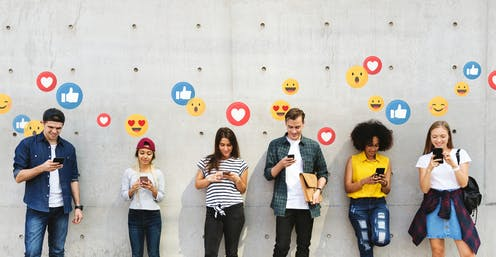

# Social Media Content Filtering
Samantha Baltodano

## Table of Contents
* [Overview](#overview)
* [Business Understanding](#business-understanding)
* [Data Understanding and Preparation](#data-understanding-and-preparation)
* [Analysis](#analysis)
* [Predictive Models](#predictive-models)
* [Conclusions](#conclusions)
* [Contributors](#contributors)

## Repository Links
* [Images](/Visuals)
* [Data](https://github.com/alex000kim/nsfw_data_scraper)

## Overview
    
Content filtering is a must for all mainstream social media platforms. The internet spans all corners of the world and Facebook last recorded [2.89 billion active users](https://www.statista.com/statistics/264810/number-of-monthly-active-facebook-users-worldwide/) in the secnd quarter of 2021. Intagram and Reddit fall behind with [1.074 billion](https://www.omnicoreagency.com/instagram-statistics/) and [54 million](https://www.oberlo.com/blog/reddit-statistics) active users. With so many users, an automated . Facebook and Instagram have faced a lot of controversy in the last year due to biased content filtering regarding breastfeeding photos, not to mention the controversy behind the possible constitional violation of the first ammendment right. Content filtering 

## Business Understanding

## Data Understanding and Preparation
I collected my `neutral`, `sexy`, `explicit` image classes through the [NSFW Data Scraper](https://github.com/alex000kim/nsfw_data_scraper) on Github. The data was noisy, misclassifying many `sexy` and `explicit` images with one another which would be detrimental to the integrity of my classifier; I manually sorted through the images to ensure that my model performance and accuracy was not negatively impacted by the misclassifications. After classifying and removing corrupt images, I ended with total of 92,xxx photos to feed my classifier. 

Split images into Train/Test/Split folders using the `os` and `shutil `libraries

<INSERT IMAGE> ???

Images were converted to grayscale to 1) Reduce computational complexity and 2) Prevent possible racial bias in the event that racial minorities were under or over represented within certain image classes. Image quality reduced to (80,80), again to reduce computational complexity.
    
<INSERT IMAGE> ???

## Analysis

## Predictive Models

    
<INSERT FINAL MODEL SUMMARY>
    
<INSERT FINAL MODEL ACCURACY AND RECALL/CONFUSION MATRIX>
    
*** EXPLAIN FINAL MODEL LAYERS AND THEIR PURPOSE/EFFECT
    
## Conclusions

## Contributors
- Samantha Baltodano  
    Github: [sbaltodano](https://github.com/sbaltodano) 
