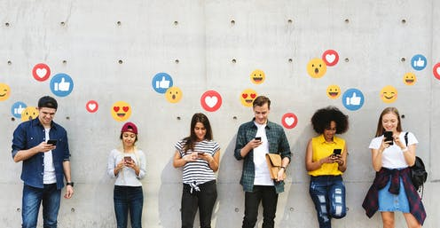
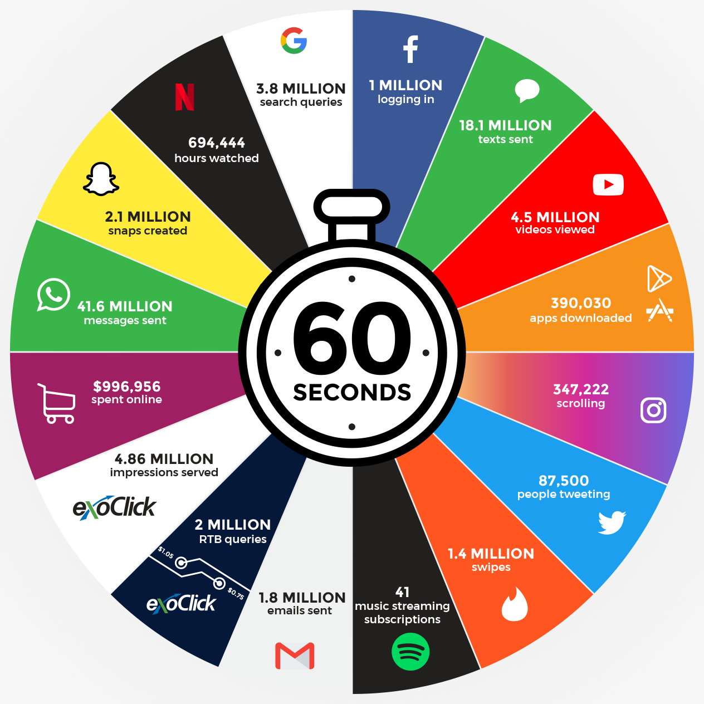
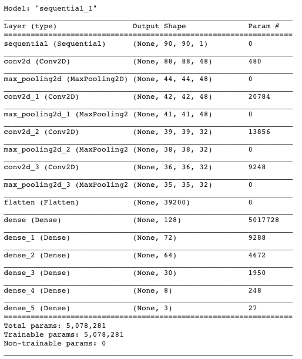
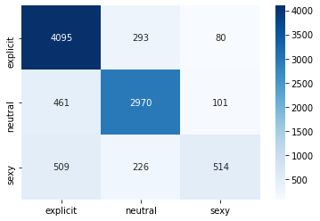
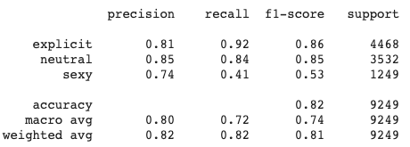
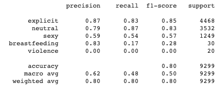
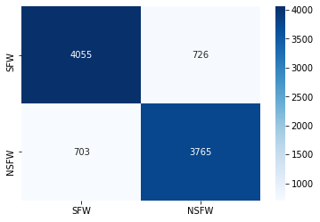
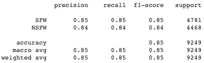
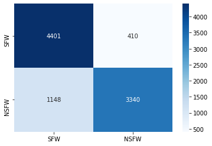
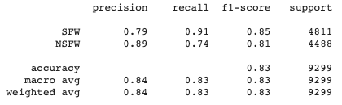

# Social Media Content Filtering
Samantha Baltodano

## Table of Contents
* [Overview](#overview)
* [Business Understanding](#business-understanding)
* [Data Understanding and Preparation](#data-understanding-and-preparation)
* [Predictive Models](#predictive-models)
* [Analysis and Conclusions](#analysis-and-conclusions)
* [Contributors](#contributors)

## Repository Links
* [Images](/Visuals)
* [Data](https://github.com/alex000kim/nsfw_data_scraper)
* [Webscraping Files](/Webscraping)

## Overview
In this project I sought to build an image classifier similar to the ones on social media platforms, capable of filtering out sexually explicit content. After further research I learned that image filters and content filtering generally speaking were very sensitive topics; many social platforms have received lash back from users for their non-inclusive content filtering. With this knowledge the project grew to include 4 different final CNN network models.

> 1) 3-class convolutional neural network with `neutral`, `sexy`, `explicit` image classes
> 2) 5-class convolutional neural network with `neutral`, `sexy`, `explicit`, `violent`, `breastfeeding` image classes
> 3) Binary convolutional neural network with `SFW` (Suitable For Work) and `NSFW` (Not Suitable For Work) image classes using only photos from the first three classes: `neutral`, `sexy`, `explicit`
> 4) Binary convolutional neural network with `SFW` and `NSFW` image classes using all photos from the 5 classes: `neutral`, `sexy`, `explicit`, `violent`, `breastfeeding`

The `violent` category was included to account for different types of explicit, NSFW images, and the `breastfeeding` class was added in response to protest following the #freethenipple movement and Instagram's banning of breastfeeding photos (which has since been unbanned) several years ago.

## Business Understanding
Social media spans all corners of the world - Facebook last recorded [2.89 billion active users](https://www.statista.com/statistics/264810/number-of-monthly-active-facebook-users-worldwide/) in the second quarter of 2021 and Intagram and Reddit fall behind with [1.074 billion](https://www.omnicoreagency.com/instagram-statistics/) and [54 million](https://www.oberlo.com/blog/reddit-statistics) active users. With a platform reaching so many people, content filtering is crucial to protect users from inappropriate and possibly traumatizing images. Facebook even has an entire team of [content moderators](https://www.theverge.com/2019/2/25/18229714/cognizant-facebook-content-moderator-interviews-trauma-working-conditions-arizona) whose entire days are spent manually reviewing photos and posts for this very reason.

Despite the good intent behind content filtering on social platforms, Instagram and Facebook have received a lot of public scrutiny regarding the #freethenipple movement, claims racial bias when banning accounts and images, and even lawsuits against the platforms for violation of user freedom of speech/expression. Machine learning models. My goal was to build a image classifier capable of filtering explicit sexual content while also remaining inclusive of all types of people and of their content. I created numerous binary and multiclass image classifiers to protect user freedom as well as protect their "innocence."

## Data Understanding and Preparation
I collected my `neutral`, `sexy`, `explicit` image classes through the [NSFW Data Scraper](https://github.com/alex000kim/nsfw_data_scraper) on Github. The data was noisy, misclassifying many `sexy` and `explicit` images with one another which would be detrimental to the integrity of my classifier; I manually sorted through the images to ensure that my model performance and accuracy was not negatively impacted by the misclassifications. After re-classifying and removing corrupt images, I ended with total of 92,443 photos to feed my classifier. Note that although I did sort through these images myself, there was plenty of room for human error due to the sheer number of images. Even after filtering, I still came across several misclassified images, specifically within the `sexy` category.

Images were split into Train/Test/Split folders using the `os` and `shutil` libraries. Images were then converted to grayscale to 1) Reduce computational complexity and 2) Prevent possible racial bias in the event that racial minorities were under or over represented within certain image classes. Image quality was reduced to (80 x 80), again for the sake of computation time. 

In addition to the NSFW Data Scraper, I needed to collect some images myself. Photos were webscraped from Google Images to provide the `violent` and `breastfeeding` categories and the .py files for scraping can be found in the [webscraping](/Webscraping) folder for future use. Even with a Google search, these images were still hard to come by and only contain between 300-400 photos within each category. The `violent` photos were especially hard to come by because they required very specific search terms and provided few images per search. In the future I would need to find more of these photos possibly from social media sites themselves and I would need to scrape from Google webpages as well as Google Images. 

The very large class imbalance in the `violent` and `breastfeeding` categories was expected to play a big role in the performance of my models, even with data augmentation. As a result, I created a dataset where I downsampled `neutral`, `sexy`, `explicit` image classes to only 250-400 images per class. The total downsampled dataset contained only 1561 images. The downsampled dataset was modeled first with an image size of (80 x 80) and lastly by an image size of (521 x 521) since there were so few images.

## Predictive Models
1. Due to the time constraints of this project, I chose to find an optimal convolutional neural network for the 3-class image classifier of `neutral`, `sexy`, `explicit` images and reuse the best model for the 5-class image classifier and the two binary classifiers. After many modeling attempts I created a 3-class CNN model with 81.5% accuracy.

As expected, this model had the most difficulty classifying the `sexy` images, often confusing them with `explicit` images. Some of this can be explained by the model itself, but as I previously mentioned there were still many misclassified `sexy` images after manual re-classification which affected the models performance.

This model did a great job filtering out `explicit` content, with a 92% recall, but falls short of its goal of remaining inclusive. This inclusivity was measured by `sexy` image recall of only 41%.

2. This same model was tested for the 5-class CNN and came up with an accuacy of 80.5%. Unfortunately, this model did a poor job of correctly filtering `violent` and `breastfeeding` photos, correctly classifying 0 `violent` photos. Though violence has nothing to do with inclusivity in content, these photos depicted very violent crime scenes and deceased bodies, which makes their misclassifications as `neutral` alarming as they would be classified as `SFW` in  a binary model. 

3. The first binary model using the images from only the first three classes performed the best out of any model with a 84.5% accuracy. After some anaysis, it is likely due to the hundreds of `sexy` misclassified photos as `neutral` and vice versa which in this model are both considered `SFW`.

4. The second binary model which includes photos from all 5 image classes performed slightly worse than the first binary model with 80.2% accuracy, due to it's missclassification of `violent` photos as `SFW`.

    
## Analysis and Conclusions
When it concerns inclusivity, these models fall short of allowing freedom of expression (`sexy` photo misclassifications as `explicit`) and allowing nursing photos (misclassification of `breastfeeding` photos as `explicit`). In removing explicit content, the final models did a great job in correctly classifiying sexually explicit content and not violent explicit content. It is also difficult to measure just how well it accounts for racial bias in data without it being deployed. These CNN models leave a lot to be desired, but overall an accuracy of 80-85% on each model performs nearly twice as well as the baseline model.

It is important to note that the CNN models are so complex that they could likely never be deployed on actual social network platforms. To do this, the CNN would need to be decreased in size while maintaining accuracy. Here's a [source](https://towardsdatascience.com/decrease-neural-network-size-and-maintain-accuracy-knowledge-distillation-6efb43952f9d) for how I can accomplish this in the future.

## Contributors
- Samantha Baltodano  
    Github: [sbaltodano](https://github.com/sbaltodano) 
